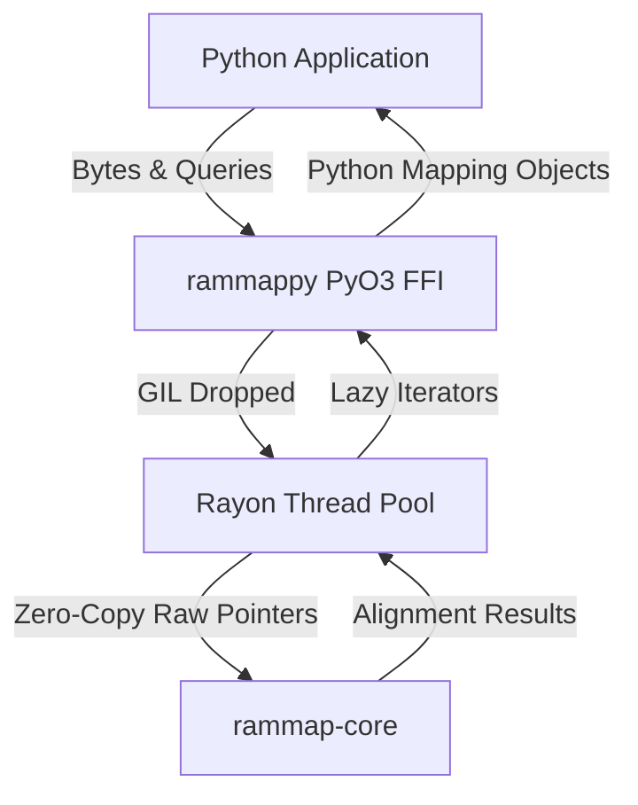

# 🔗🐍🧬 rammappy [](https://github.com/tomdstanton/rammappy/stargazers)

*[PyO3](https://pyo3.rs/) bindings and Python interface to [rammap](https://github.com/jwanglab/rammap), the Rust implementation of minimap2.*

[](https://img.shields.io/github/v/release/tomdstanton/rammappy)
[](https://pypi.org/project/rammappy)
[](https://github.com/astral-sh/ruff)
[](https://github.com/astral-sh/ty)

> [!WARNING]
> This library is still a work-in-progress, and in an experimental stage, with API breaks very likely between minor versions.

---

## 🗺️ Overview

`minimap2` is a widely used mapping tool for nucleotide sequences. `rammap`[^1] is a reimplementation of minimap2 in Rust, demonstrating perfect concordance while enabling performance optimizations for modern architectures. It maintains Rust's stronger memory safety constraints and provides a modular architecture.

`rammappy` is a Python module, implemented using the [PyO3](https://pyo3.rs/) framework, that provides bindings to `rammap`. It directly links to the `rammap-core` code, which provides the following advantages:

- **zero-copy**: Sequences are passed around as contiguous blocks of C-memory storing the byte sequences.
- **multithreaded**: True parallel alignment inside a detached thread context that completely drops the Python GIL during batch processing.
- **lazy evaluation**: Iterator-based result generation ensures massive mapping tasks don't blow up system memory.

## 🔧 Installing

`rammappy` can be installed directly from [PyPI](https://pypi.org/project/rammappy/), which hosts some pre-built CPython wheels.

If you are building from source or working on development, we prefer using `uv` for environment and dependency management, along with `just` as a command runner:

```console
$ just install
```
*(This command wraps `uv venv --allow-existing` and `uv pip install -e .`)*


## 💡 Examples

### 🧠 Building an Index In-Memory

A significant advantage of `rammappy` over `mappy` (the official minimap2 Python bindings) is the ability to build an `Index` directly from in-memory sequences. In `mappy`, reference sequences must generally be read from a FASTA file on disk. `rammappy` allows you to skip the disk I/O entirely:

```python
import rammappy

# Define reference sequences
refs = [
    (b"chr1", b"ACGT" * 1000),
    (b"chr2", b"TGCA" * 1000)
]

# Build the index completely in-memory
index = rammappy.Index.build(refs, k=15, w=10)

# Optionally save it for later use
index.save("reference.mmi")

# You can also fetch sequences directly from the index!
print(index.seq("chr1", start=0, end=10))
```

### 🔨 Instantiating an Aligner

You can create an aligner by providing the built index and a preset configuration.

```python
# Pass the in-memory index directly to the Aligner
aligner = rammappy.Aligner(index, preset=rammappy.Preset.Sr)
```

### 🔬 Batch Alignment

Querying multiple sequences can be done via `map_batch`, which drops the GIL and runs in parallel using Rust's Rayon ecosystem:

```python
queries = [
    (b"query1", b"ACGT" * 20),
    (b"query2", b"CGTA" * 20),
]

batch_results = aligner.map_batch(queries)

# Lazy-evaluate the iterator to pull hits
for i, mappings in enumerate(batch_results):
    first_hit = next(iter(mappings), None)
    if first_hit:
        print(f"Query {i+1} mapped to {first_hit.target_name.decode()} at {first_hit.target_start}")
```

### 📊 Exploring Sketchers

Direct access to seeding algorithms is available for customized genomic sketching:

```python
sketcher = rammappy.MinimizerSketcher(kmer_len=15, window_len=10)
seed = sketcher.sketch(b"ACTG" * 50)[0]
print(f"Minimizer at position {seed.x} with y-value {seed.y}")
```

## 🏗️ Architecture & Implementation Philosophy

The overriding goal for this project was to establish **extremely performant, zero-copy FFI bindings** linking the Rust core API to Python. A focus was applied to maintain "bare metal Rust" speeds while providing a clean and "lazy" Python API.



### Zero-Copy Evaluation Using `bytes`
Python strings (`str`) perform computationally expensive UTF-8 allocations and validation mechanisms. `rammappy` universally prefers Python byte-strings (`bytes` in Python, mapped to `&[u8]` in Rust). Data entering the alignment algorithm uses `Bound<'py, PyBytes>`, mapping directly to contiguous blocks of C-memory storing the sequences. Retrieving genomic strings mapping fields (e.g., CIGAR/MD/CS strings) exposes byte payloads directly without additional UTF-8 reallocations during FFI crossings.

### In-Memory Indexing vs Disk I/O
Traditional bindings like `mappy` force users to write target sequences to a FASTA file before an index can be built and queried. `rammappy` decouples the `Index` from the `Aligner`, allowing indexes to be built dynamically from raw memory bytes inside Python, completely eliminating disk I/O bottlenecks for dynamic or programmatic reference generation.

### Parallel Scaling and the Python GIL
Scaling genomic query alignments in parallel on multi-core systems mandates threading. However, the presence of the Python Global Interpreter Lock (GIL) poses problems, as normal PyO3 structures retain a lock on the main Python thread.

**The Solution:**
We collect batches of targets mapped to pointers and lengths. We wrap these representations in a custom struct `RawQuery { name_ptr, seq_ptr, ... }`. We implement `unsafe impl Send for RawQuery` and `unsafe impl Sync for RawQuery`, allowing pointer transmission across thread boundaries. The GIL is then released via `py.detach(|| { ... })`, and `rayon` handles iterating and distributing alignments across all CPU cores. `unsafe { std::slice::from_raw_parts }` safely rebuilds the byte vectors in the isolated thread spaces, as the parent function's stack guarantees the memory allocation outlives the closure.

### Lazy Materialization
Rather than computing alignment lists as heavy `Vec<Mapping>` aggregates and immediately converting every hit to a Python-native object (costing heavy FFI time), `rammappy` returns a `MappingIterator`. A `MappingIterator` acts as an opaque handle holding the vector of internal `RustMapping` entries. Only when a user invokes `next(iterator)` is the memory read and a single Python `Mapping` object initialized and surfaced over the FFI boundary.

---

## 👏 Acknowledgments

We would like to thank the original authors of `rammap`, Jeremy R. Wang and Heng Li, for their high-performance reimplementation of minimap2 in Rust.

## 📚 References

[^1]: Jeremy R. Wang and Heng Li. Memory-safe high-performance sequence mapping with rammap (2026). bioRxiv. [10.64898/2026.05.26.726289](https://doi.org/10.64898/2026.05.26.726289).
